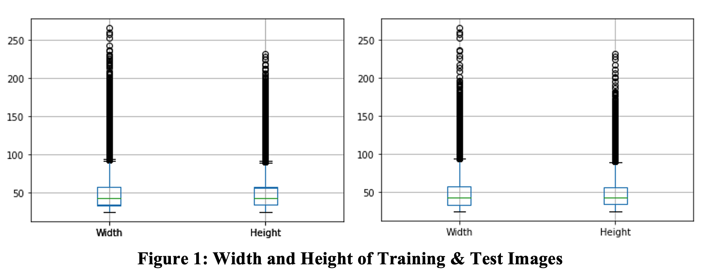
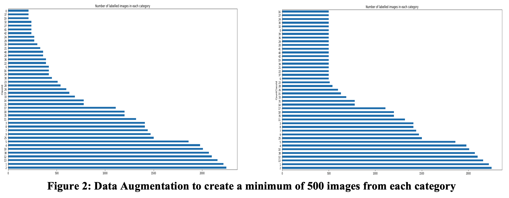
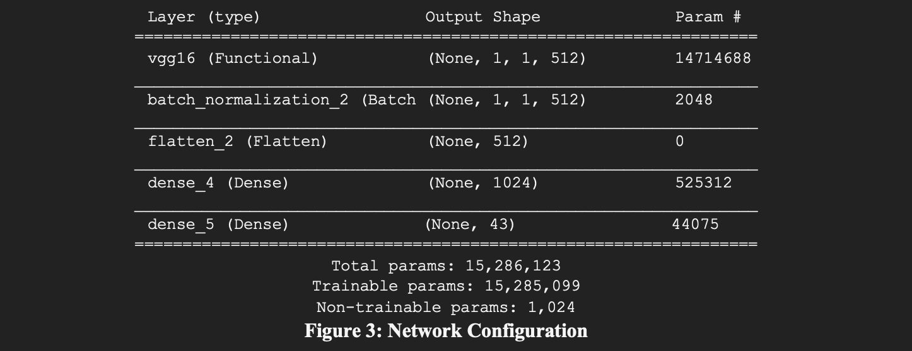
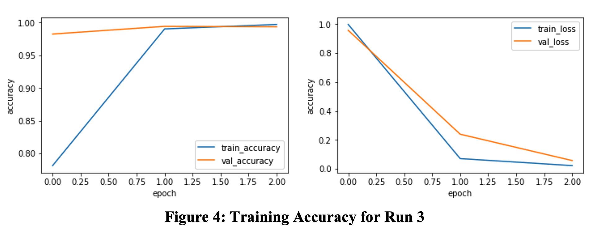

The dataset can be found here: 

# Training a VGG16 Network to Classify Traffic Signs using the German Traffic Sign Recognition Benchmark (GTSRB)

James O&#39;Connor _COMP09012 - IT Sligo_

**Abstract**

A lot of work has been put into CNNs in the past twenty years. Thankfully, much of this effort can be reused through transfer learning. This report demonstrates how the pre-trained VGG16 CNN model can be reused to build a CNN for recognising 43 classes of traffic signs.

**Keywords:** VGG16, Traffic Light Detection, GTSRB, CNN, Transfer Learning

# 1. Introduction &amp; Plan

The aim of this report is to retrain a CNN using images of traffic signs, to see if it can be used to recognise previously unseen traffic signs. Transfer learning for image detection involves reusing existing models that have been developed for standard vison benchmark sets such as ImageNet (Russakovsky, et al., 2015). We can then re-use them and extend them for our own use without having to retrain the models from scratch, which would be time consuming and computationally expensive. The VGG classifier was developed in 2015 by Simonyan &amp; Zisserman (2015) and consists of a 16-19 layer network and today it is widely used for many forms of image recognition. The Visual Geometry Group (VGG) sixteen layer network will be used in this report as a classifier. The image data used is the German Traffic Sign Recognition Benchmark (GTSRB) (Kaggle, 2018).

# 2. Hardware &amp; Programs

The hardware used to build and test the models was a 2 GHz (boost to 3.7GHz) Quad-Core Intel Core i5 processor and 16 GB LPDDR4X RAM. Keras, a python interface library for TensorFlow was used to access the VGG16 network and to construct the final layers of the CNN. Jupyter notebook was used as an IDE, notebook [(GitHub Code)](https://github.com/jameseoconnor/vgg-traffic-light-detection)

# 3. Pre-Processing Data

The three main tasks undertaken to pre-process the data was to resize the images, balance the dataset and normalise the images.

**3.1**  **Resize Images**

The first task was to analyse the size of the training and test images by height and width. All images are color images, therefore each has three channels, RGB. Initial analysis of the training data showed the training data (Figure 1 left) is of median size 50.83 x 50.32 x 3 (w \* h \* d) with a 25 – 243 width interval and 23-225 height interval. Initial analysis of the test data (Figure 1 right) showed the data is of median size 50.5 x 50.36 x 3 (w \* h \* d) with a 25 – 266 width interval and 23-232 height interval.

Square images need to be generated in order for the VGG16 network to accept the images as inputs. OpenCV was used to first square the images using cv2.warpAffine(), followed by cv2.resize() to resize the squared image to the desired shape. Once the images had been resized, they were combined into two NumPy arrays, one for the resized image matrix and the other for the label, our y value. As the training data was consecutively labelled by sub-folder, which is the class, the training data array were shuffled to randomise the data. As the minimum size input for the VGG16 is 32px\*32px, an initial value of 50px was selected for the width and height of the images, close to the median weights and heights from the datasets.

**3.2 Balance Dataset**

The number of images in each category varied greatly. Looking at a simple bar plot from the training dataset, shows a range from 210 – 2250, which is approximately a ten-fold difference between number of samples in different classes. There are a number of techniques that can used to balance this dataset. One of the ways is through data augmentation. This has been shown to be effective in increasing accuracy of training of an unbalanced dataset for traffic signals (D. Temel, 2017). Random methods are applied to random images from the lacking categories including crop, scale, translate, rotate, shear and mirror, until the quota for minimum images are met. The approach here was based on the work of Rusanov (2020), where the minimum of 500 images per category was suggested through experiment. The training set increased from 39211 to 42739 as per Figure 2.

**3.3**  **Normalise the Dataset**

To normalise the data, each numeric value representing the RGB channel was divided by 255. This means that all of our input test and train values are now between 0 and 1. The label data was converted to categorical data, meaning that each label became an array of size 43.

| **Dataset** | **N1** | **N2** | **N3** | **N4** | **Total Data Points** |
| --- | --- | --- | --- | --- | --- |
| Train\_Images | 42739 | 50 | 50 | 3 | 320,543,540 |
| Train\_Labels | 42739 | 43 | 0 | 0 | 1,837,777 |

**Table 1: Total Initial Data Points.**

# 4. The Network

One decision that has to be made is where along the pretrained to accept the output. The closer the design of the network is to what is required, the further along the network the output can be accepted. One possible solution to building this CNN would be to create one from scratch. However, by using a pre-existing trained base model, all that is needed is to change the final few layers to make it work with the new dataset. Therefore, when the VGG16 net was downloaded, the three fully connected layers (FCL) were excluded. The below configuration was used for the top layer of the network.

1. **Batch Normalization** – to standardise the output of the vgg16 network, for increased efficiency.
2. **Flatten** – To convert the output of the vgg16 network to a one dimensional array for inputting to fully connected (dense) layer.
3. **Dense Layer** - Sigmoid Activation – single fully connected layer for the purpose of learning the new images (transfer learning).
4. **Dense Layer** - Softmax Activation – The softmax layer will be used to represent the relative probabilities of each of the classes.

# 5. Training and Testing Model

## Choosing Hyperparameters

An iterative approach was taken in training the model to recognise the 43 separate classes. There were a number of hyperparameters that needed to be selected with including epoch, batch size, learning rate. The batch size would determine the iterations needed to be performed per epoch and amount of memory used for each iteration.

## Test Results

A number of tests were completed with various parameters. In Run 2 the image size was changed to 32px to reduce the number of datapoints, and the learning rate was increased by a factor of 10 to examine the impact on the result. In Run 3, the VGG19 classifier was used to examine the impact on accuracy and training performance. In Run 4, the impact of the ReLu activation function in the dense\_4 FCL was examined. Highest test accuracy achieved was 96.36%. Figure 4 below shows the training accuracy of Run 3, with 3 epochs.

| **Run** | **Training Sample Size (80%)** | **Classifier** | **Image Size(w,h)** | **Activation** | **Epochs** | **Batch Size** | **Iterations** | **Learning Rate** | **Trainable\_Params** | **Train\_Time (s)** | **Test Accuracy** |
| --- | --- | --- | --- | --- | --- | --- | --- | --- | --- | --- | --- |
| 1 | 34191 | VGG16 | 50 | Sigmoid | 2 | 128 | 267 | 0.0001 | 15,285,099 | 1943 | **0.9692** |
| 2 | 31369 | VGG16 | 32 | Sigmoid | 2 | 128 | 245 | 0.001 | 15,285,099 | 1159 | **0.56** |
| 3 | 31369 | VGG19 | 50 | Sigmoid | 3 | 256 | 123 | 0.0001 | 20,594,785 | 3261 | **0.96175** |
| 4 | 34191 | VGG16 | 50 | ReLu | 2 | 128 | 267 | 0.0001 | 15,285,099 | 1963 | **0.9636** |

**Table 2: Test Results for Run 1-4**

# Conclusion

In conclusion, the VGG16 network has successfully been added to and a new traffic sign classifier has been generated, with accuracy of up to 96.36%. Further research on this would be to conduct a more thorough analysis of hyper parameter tuning as well as the addition of a second FCN to add more tuneable parameters.

# Bibliography

D. Temel, G. K. M. P. a. G. A., 2017. CURE-TSR: Challenging unreal and real environments for traffic sign recognition. _Neural Information Processing Systems (NIPS) Workshop on Machine Learning for Intelligent Transportation Systems (MLITS),._

Kaggle, 2018. _GTSRB - German Traffic Sign Recognition Benchmark._ [Online]
 Available at: https://www.kaggle.com/meowmeowmeowmeowmeow/gtsrb-german-traffic-sign/notebooks?datasetId=82373
 [Accessed Jan 2021].

Rusanov, I. S., 2020. _Traffic Sign Recognition Problem with GTSRB, Python and Keras._ [Online]
 Available at: https://medium.com/ai-in-plain-english/traffic-sign-recognition-problem-with-gtsrb-python-and-keras-21782b7b3520

Russakovsky, O. et al., 2015. _ImageNet Large Scale Visual Recognition Challenge,_ s.l.: Stanford.

Simonyan, K. &amp; Zisserman, A., 2015. _Very Deep Convolutional Networkd For Large Scale Image Recognition._ s.l., ICLR.